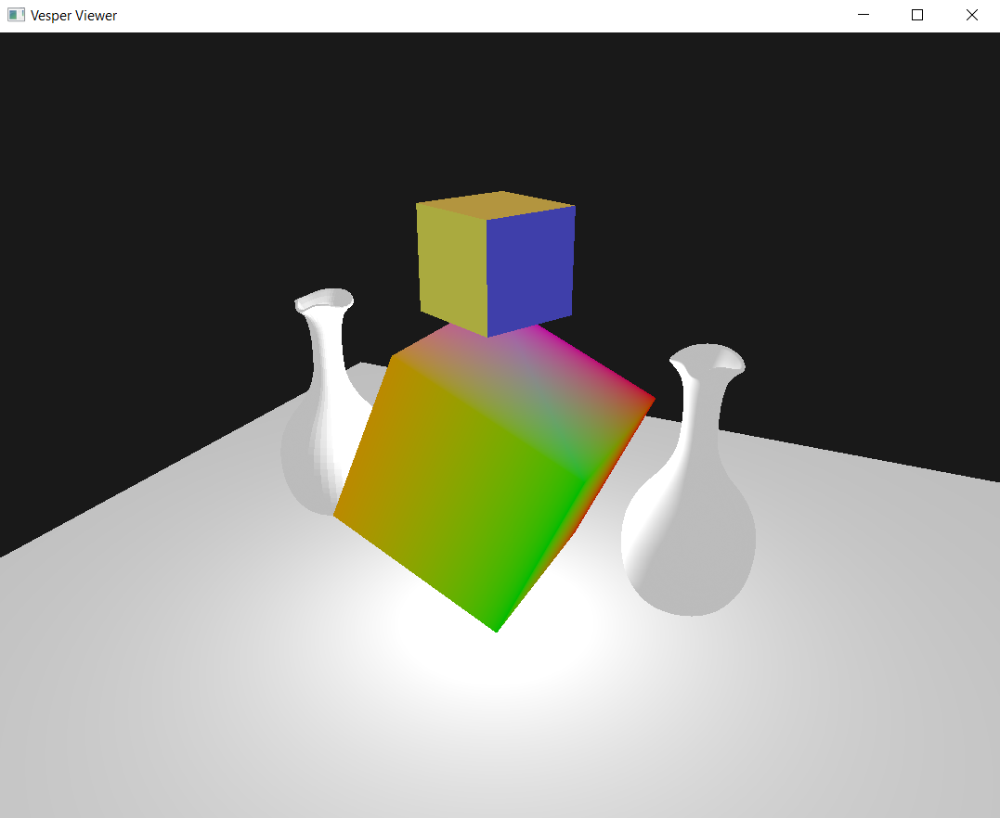

# Vesper
Render Engine Using the Vulkan API

This engine was created from scratch to explore the Vulkan API and learn more about this modern graphics API. I am not a rendering or engine programmer, so please bear that in mind!

> "Vesper" means evening in Latin

The main and important distinction between this engine and many others is that it is entirely powered by my own [ECS](https://github.com/KabalMcBlade/ECS-API) library. 
When I say "fully," I mean every part of it: objects to be rendered must have a vertex and/or an index buffer component assigned, just to name one example

## Screenshots

I will post screenshots here as new features are added and when there’s something significant to show.

First render from the engine, using the ECS core.

## Demo Controls

For now, the demo simply loads a couple of cubes and two OBJ vases, adding a point light. 
It will evolve into a proper viewer in the future.

## LICENSE

GPL-3.0

# Build Status

| Platform | Build Status |
|:--------:|:------------:|
| Windows (Visual Studio 2022) | [] |

